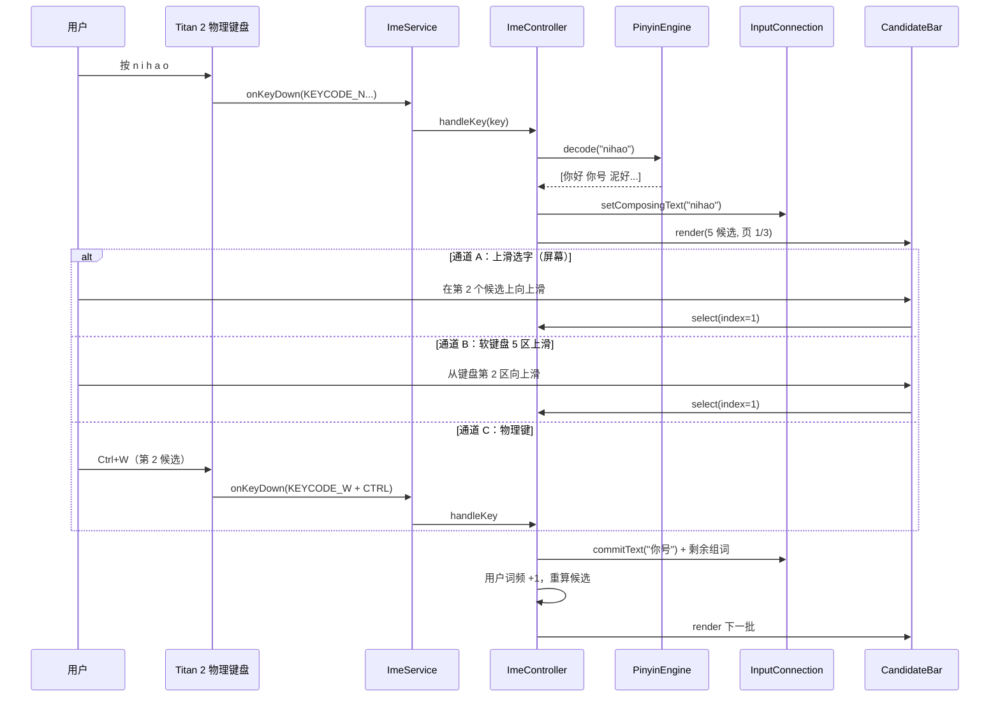
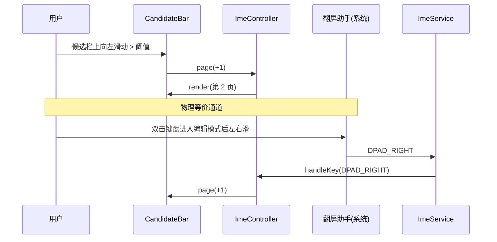
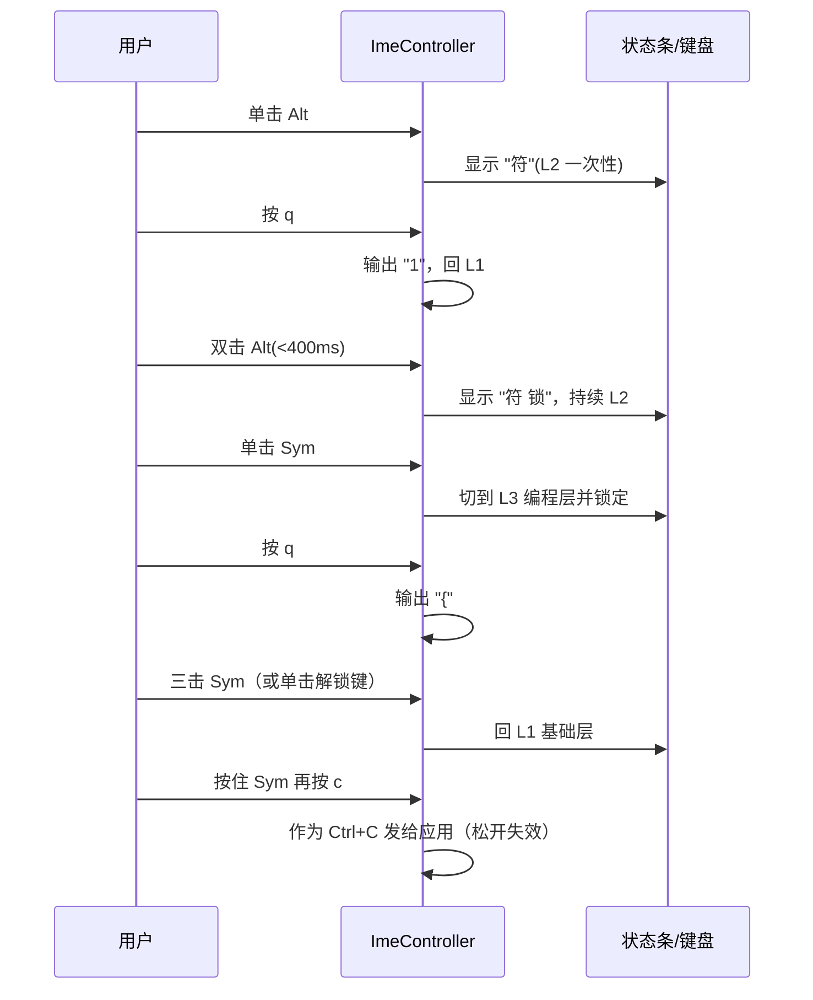

# Key flows

## 1. 打一句拼音并用三种方式选字

```mermaid
sequenceDiagram
    participant User as 用户
    participant Kbd as Titan 2 物理键盘
    participant Svc as ImeService
    participant Ctrl as ImeController
    participant Eng as PinyinEngine
    participant IC as InputConnection
    participant Bar as CandidateBar

    User->>Kbd: 按 n i h a o
    Kbd->>Svc: onKeyDown(KEYCODE_N...)
    Svc->>Ctrl: handleKey(key)
    Ctrl->>Eng: decode("nihao")
    Eng-->>Ctrl: [你好 你号 泥好...]
    Ctrl->>IC: setComposingText("nihao")
    Ctrl->>Bar: render(5 候选, 页 1/3)

    alt 通道 A：上滑选字（屏幕）
        User->>Bar: 在第 2 个候选上向上滑
        Bar->>Ctrl: select(index=1)
    else 通道 B：软键盘 5 区上滑
        User->>Bar: 从键盘第 2 区向上滑
        Bar->>Ctrl: select(index=1)
    else 通道 C：物理键
        User->>Kbd: Ctrl+W（第 2 候选）
        Kbd->>Svc: onKeyDown(KEYCODE_W + CTRL)
        Svc->>Ctrl: handleKey
    end

    Ctrl->>IC: commitText("你号") + 剩余组词
    Ctrl->>Ctrl: 用户词频 +1，重算候选
    Ctrl->>Bar: render 下一批
```

## 2. 左右滑候选词翻页

```mermaid
sequenceDiagram
    participant User as 用户
    participant Bar as CandidateBar
    participant Ctrl as ImeController
    participant Kbd as 翻屏助手(系统)
    participant Svc as ImeService

    User->>Bar: 候选栏上向左滑动 > 阈值
    Bar->>Ctrl: page(+1)
    Ctrl->>Bar: render(第 2 页)
    Note over User,Kbd: 物理等价通道
    User->>Kbd: 双击键盘进入编辑模式后左右滑
    Kbd->>Svc: DPAD_RIGHT
    Svc->>Ctrl: handleKey(DPAD_RIGHT)
    Ctrl->>Bar: page(+1)
```

## 3. Alt / Sym 锁定与三层切换

```mermaid
sequenceDiagram
    participant U as 用户
    participant C as ImeController
    participant B as 状态条/键盘

    U->>C: 单击 Alt
    C->>B: 显示 "符"(L2 一次性)
    U->>C: 按 q
    C->>C: 输出 "1"，回 L1
    U->>C: 双击 Alt(<400ms)
    C->>B: 显示 "符 锁"，持续 L2
    U->>C: 单击 Sym
    C->>B: 切到 L3 编程层并锁定
    U->>C: 按 q
    C->>C: 输出 "{"
    U->>C: 三击 Sym（或单击解锁键）
    C->>B: 回 L1 基础层
    U->>C: 按住 Sym 再按 c
    C->>C: 作为 Ctrl+C 发给应用（松开失效）
```

## 4. 词库导入

设置 → 词库 → 选择文件 → 校验 `词/拼音/词频` TSV（拒绝无拼音行）→ 备份现有用户词库 → 合并 → 重建前缀索引 → 提示条目数与可回退。
